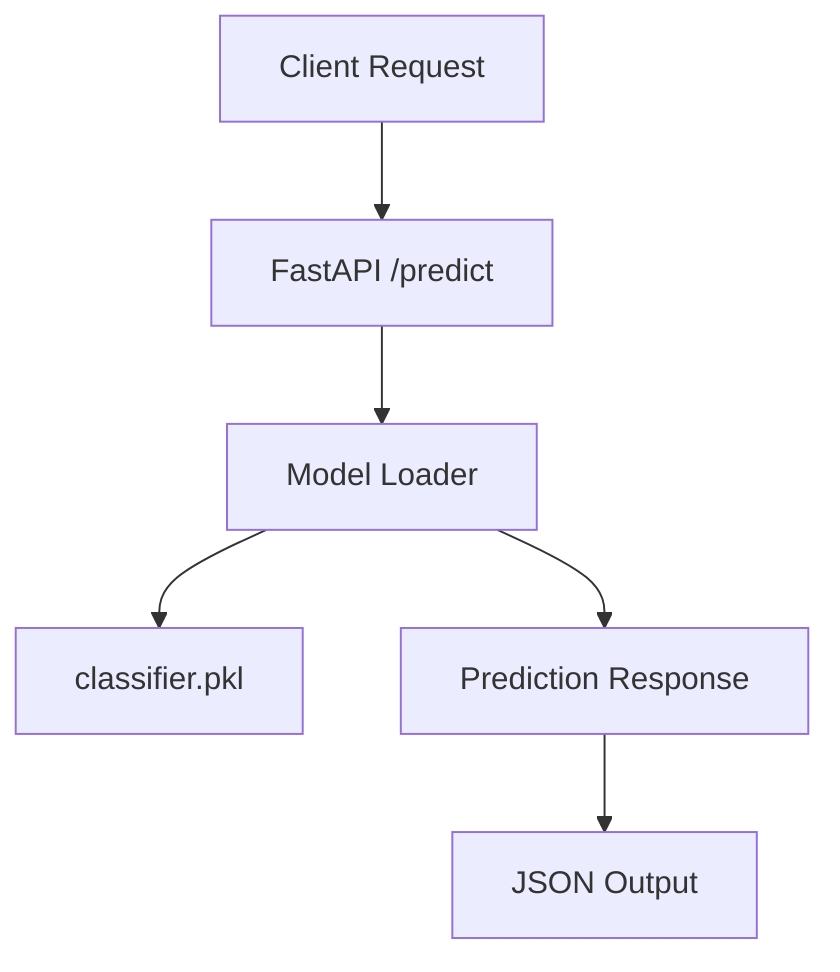

# ML Inference API — FastAPI + Docker

A production-style **ML inference API** for tabular data.
The project loads a pretrained classifier, exposes a `/predict` endpoint, and runs inside a Docker container.

Ideal as a template for ML engineering / MLOps workflows.

---

## 🚀 Features

* FastAPI-based inference service
* Dockerized application (production-ready structure)
* Sklearn model loaded at startup
* Clean folder structure used in real ML Engineering teams
* Fully working `/predict` endpoint
* Automated tests (pytest)

---

## 📂 Project Structure

```
.
├── app/
│   ├── main.py
│   ├── model.py
│   ├── schemas.py
│   └── utils.py
├── models/
│   └── classifier.pkl
├── tests/
│   └── test_api.py
├── Dockerfile
├── requirements.txt
├── README.md
└── assets/
    └── screenshot-docs.png
```

---

## 🧠 How It Works (Architecture)



---

## ▶️ Run Locally

```
uvicorn app.main:app --reload
```

Swagger docs available at:

```
http://localhost:8000/docs
```

---

## 🐳 Run with Docker

```
docker build -t ml-api .
docker run -p 8000:8000 ml-api
```

---

## 📡 Example Request

```
POST /predict
Content-Type: application/json

{
  "sepal_length": 5.1,
  "sepal_width": 3.5,
  "petal_length": 1.4,
  "petal_width": 0.2
}
```

### Example Response

```
{
  "prediction": 0
}
```

---

## 📸 Screenshot


---

## ✔️ Technologies Used

* **FastAPI**
* **scikit-learn**
* **Docker**
* **pytest**
* **Uvicorn**

---

